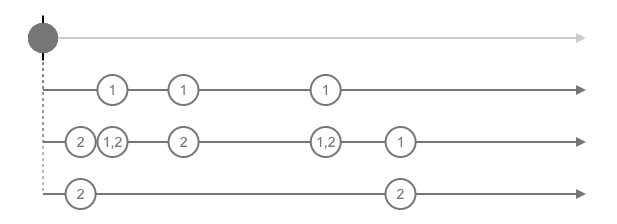

A friend at work was trying to find a use-case for RxJS in the admin panel.
He came up with filtering buttons on a chart that act as toggle buttons. So
that clicking once the buttons 2 and 1,
calls the endpoint [/api/data?filter[]=2&filter[]=1](#).
and clicking again the button 1, would result in calling [/api/data?filter[]=2]().

Looks in Rx, we think in streams. Clicks on the button 1 and 2 are streams.
So this problems can be seen as:



Toggling one button is simple: `nextState = !state`. To keep track of multiple
buttons, turn the state to an object: one key per button. Toggling then become:
`nextState = {...state, [buttonId]: !state[buttonId]}`. To apply this on streams, I tried
to merge click streams, and apply above technique:

``` javascript
buttons1
  .pipe(merge(buttons2))
  .pipe(scan((acc, buttonId) => ({ ...acc, [buttonId]: !acc[buttonId] }), {}))
  .pipe(map(x => Object.keys(x).filter(k => x[k])))
```

And to simulate the clicks, I created random streams like this:

``` javascript
const random = () => Math.random() > 0.3
const g = (source, id) =>
  source
   .pipe(map(random))
   .pipe(distinctUntilChanged())
   .pipe(filter(identity), mapTo(id))
const source = interval(1000)
const buttons = [g(source, 1), g(source, 2)]
```

You can play with the visualization [here](https://rxviz.com/v/j8AnVy3o).

While creating the visualization, I realized the button streams I created above are
cold observables. Here is one way I found to make them hot:

``` javascript
const random = () => Math.floor(Math.random()* 10)
const cold = interval(1000).pipe(map(random))

const multicast = (source) => {
  const subject = new Subject();
  source.subscribe(subject);
  return subject;
}

const hot = multicast(cold)
of(1,2).pipe(map(() => hot))
```
